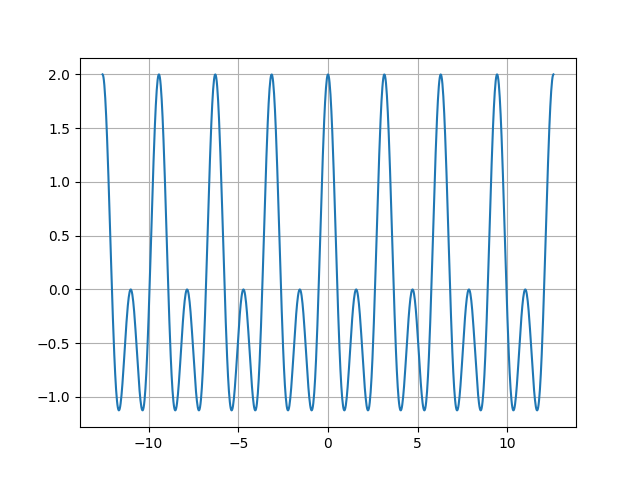
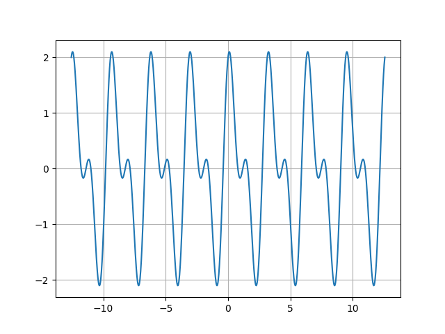

#   *绘制时域图以及频谱图*
---
> `author: 物联网2202 刘昱旗`
> `encoding: markdown`(本文档用markdown格式编码，如不方便阅读可以访问 `github` 链接)
## 1.引子

> 为了绘制时域图与频谱图，我们首先应当了解其原理，下面，我们将从原理入手，其次分析代码进行时域图及其频谱图的绘制：

## 2.时域图的绘制

> 当谈到时域图以及频谱图的时候，我们最先想到的应用场景可能就是生活当中的 `声音处理` 以及 `信号分析`
>
> 比如，我们举一个简单的例子，我们假设这里有一个简单的声音信号，它的波形大致可以拟合成： ` F(t) = cos(2t) + cos(4t) ` 
>
> 我们在python当中调用 `matplotlib` 和 `numpy` 库来进行信号的可视化来看看它的波形
>
> 至于为什么不用 `matlab` 而是用 `python` 来做主要是因为 `matlab` 占用内存太大（**~~python是全世界最棒的语言~~**），调用 `python` 更加方便并且拥有丰富的第三方库支持（例如  `numpy` 之类的），下面是我们的代码：
>
> ```python
> import numpy as np
> import matplotlib.pyplot as plt             # 导包numpy和pyplot
> 
> t = np.linspace(-4*np.pi, 4*np.pi, 1000)    # 设置时间域为( -2*pi 到 2*pi )，取1000步以防图像过于尖锐
> signal = np.cos(2*t)+np.cos(4*t)            # 设置我们想要显示的信号函数
> 
> plt.plot(t, signal)                   		# 设置显示信号函数，将参数传入
> 
> plt.grid(axis="x")                          # 添加x轴网格
> plt.grid(axis="y")                          # 添加y轴网格
> 
> if __name__ == "__main__":
>  choice = input("是否需要自定义图片保存路径？(Y/N):")
>  if choice == "Y":
>         path = input("请输入您的路径:")
>  else:
>     	path = r"..\图片资源\时域图1.png"				# 保存图片到指定path(这里没写try和expect逻辑，所以需要自己手动建一个名字叫做图片资源的文件夹)
>  path = path.replace("\\", "/")
>  plt.savefig(path)
>  plt.show()
> ```
>
> 如您所愿，运行完这段代码之后您就可以在 `图片资源` 的文件夹当中找到我们生成的名为 `时域图1.png` 的图片了，图片如下图所示：
>




> 可以看到，现在的信号尚且容易分辨出是由两个不同频率的周期三角函数合成的，但是，对于复杂的信号呢，我们以
>
> `F(t) = cos(2t) + sin(2t) + cos(4t)` 为例子，可以看到，图像开始变得复杂起来了。



## 3.频谱图的绘制

> 由于我们在现实生活中会经常遇到非常混乱复杂的波形信号，我们引入 `傅里叶变换` 来绘制频谱图，针对不同频率的信号，分析它们的幅值，我们知道一个信号可以看作是:` f(t) = a0/2 + $\sum$ an*sin(nwt + n\lambda) `
>
> 进行傅里叶变换： 下面是我们的代码
> 
```python
import numpy as np
import matplotlib.pyplot as plt                     # 导包
from scipy import fft

# 设置原始信号
t = np.linspace(-4*np.pi, 4*np.pi, 1000)      # 仍然保留相同的时域
signal = np.sin(2*t) + np.cos(2*t) + np.cos(4*t)   # 信号仍然使用与上个代码相同的信号

# 对信号进行FFT变换（进行傅里叶变换）
fft_signal = fft.fft(signal)

# 获取信号的频率值(保留len(t)长度数组)
frequency = (np.fft.fftfreq(len(signal))*2*np.pi/min(t))[:len(t)]

# 计算每个频率下的信号幅值（取对数*20计算幅值）
magnitude = 20*np.log(np.abs(fft_signal[:len(t)]))

# 绘制时域图
plt.figure(figsize=(15, 5))
plt.subplot(1, 2, 1)
plt.plot(t, signal, label='Original signal')
plt.xlabel('Time (s)')
plt.ylabel('Amplitude')
plt.title('Magnitude of the Time Spectrum')
plt.legend(loc='best')

plt.subplot(1, 2, 2)
plt.plot(frequency, magnitude, label='Frequency Spectrum')
plt.xlabel('Frequency(rad/s)')
plt.ylabel('Magnitude')
plt.legend(loc='best')

plt.title('Magnitude of the Frequency Spectrum')
plt.savefig('../图片资源/时域图&频谱图.png')
plt.show()
```

> 最后我们得到的图片如下:
> 
